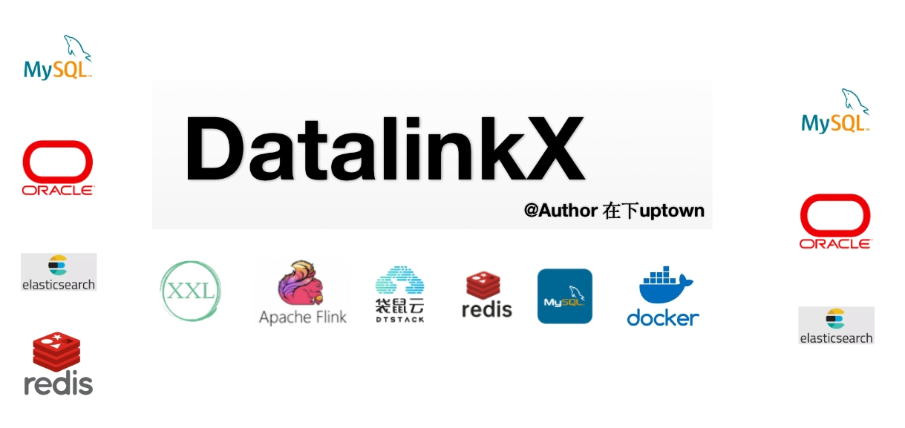

在作者（SplitfireUptown）原项目<a href=https://github.com/SplitfireUptown/datalinkx>DatalinkX</a>基础上进行了扩展

## 扩展点

### 后端：

### 1.添加用户管理模块`datalinkx-security`

基于RuoYi，通过引入SpringSecurity和JWT实现了用户管理模块，包括用户管理、角色管理、权限管理、菜单管理等功能

- 用户管理
- 角色管理
- 权限管理
- 菜单管理

### 2.添加DeepSeek大模型模块`datalinkx-deepseek`

接入DeepSeekAPI，通过SSE（Server-Send Events）实现了大模型流式输出，多伦对话等功能

- DeepSeek大模型模块

### 前端：

### 1.添加用户管理

### 2.添加DeepSeek大模型（支持文件上传、模型切换`DeepSeek-R1`、`DeepSeek-V3`））

### 3.支持直接运行Python脚本、HTML代码

### 4.添加可视化BI,支持`上传数据`、`从数据库读取`、`自定义可视化`、`动态编辑`

  

  
  
  
  
  
  
  
  
  
  
  

## 异构数据源同步服务DatalinkX介绍

**核心功能** ：在不同的异构数据源中进行数据同步，对同步任务进行管理和维护

**意义**：只要公司规模较大，部门与部门之间有数据协作都应该有类似DatalinkX的项目，比如爬虫组的同事爬下来数据要定时同步到数仓组负责的库下。同步服务会集中管理同步任务，收拢同步日志、提高内部工作效率。

## 项目特性

- **简单易用**：通过Web页面快速创建数据源、同步任务，操作简单，一分钟上手
- **定时触发**：对接xxl-job定时，设置cron表达式触发同步任务
- **配置化任务对接**：将数据库信息、任务详情界面化配置
- **高性能同步**：使用高性能流式flink计算引擎
- **容器化部署**：支持docker部署
