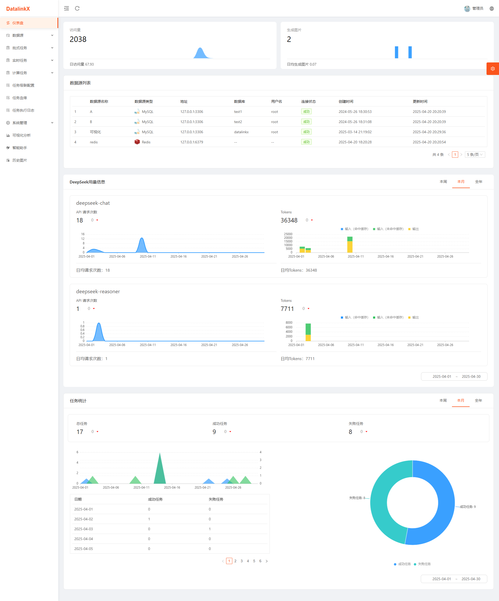
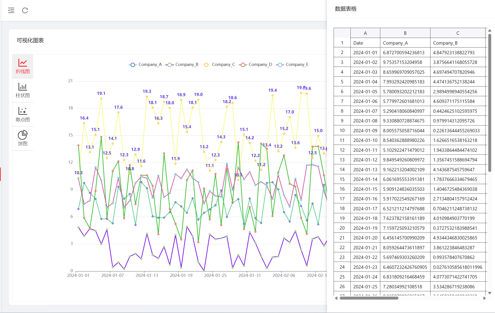

在作者（SplitfireUptown）原项目<a href=https://github.com/SplitfireUptown/datalinkx>DatalinkX</a>
基础上深度融合安全管控与AI能力，构建了包含用户权限管理、多模型智能对话、可视化BI分析的全栈解决方案。通过Spring
Security+JWT实现细粒度权限控制，集成DeepSeek大模型支持流式对话与文件解析，创新性拓展Python/HTML脚本执行环境，并打造拖拽式数据看板实现多源数据动态可视化

## 扩展点

### 前端：

### 1.添加仪表盘



### 2.添加DeepSeek大模型（支持文件上传、模型切换`DeepSeek-R1`、`DeepSeek-V3`））


### 3.支持直接运行Python脚本、HTML代码


### 4.添加可视化BI,支持`上传数据`、`从数据库读取`、`自定义可视化`、`动态编辑`




### 5.添加用户管理


#### 以及其他样式调整、功能优化等

### 后端：

### 1.添加用户管理模块`datalinkx-security`

基于RuoYi，通过引入SpringSecurity和JWT实现了用户管理模块，包括用户管理、角色管理、权限管理、菜单管理等功能

- 用户管理
- 角色管理
- 权限管理
- 菜单管理

### 2.添加DeepSeek大模型模块`datalinkx-deepseek`

接入DeepSeekAPI，通过SSE（Server-Send Events）实现了大模型流式输出，多伦对话等功能

- DeepSeek大模型模块

## 项目启动
### 后端

- 编辑`datalinkx-server/src/main/resources/application.yml`

- 修改`redis`密码`password为`自己的密码

```yml
redis:
  database: 0       # Redis数据库索引（默认为0）,如果设置为1，那么存入的key-value都存放在select 1中
  host: ${REDIS_HOST:127.0.0.1}
  port: ${REDIS_PORT:6379}
  password: ${REDIS_PASSWORD:123456}
  timeout: 10000
```

- 修改`MySQL`数据库`url`中的`datalinkx`为自己的数据库，`password`为自己的密码

```yml
datasource:
  driver-class-name: com.mysql.cj.jdbc.Driver
  username: ${MYSQL_USERNAME:root}
  password: ${MYSQL_PASSWORD:123456}
  url: jdbc:mysql://${MYSQL_URL:127.0.0.1}:3306/datalinkx?characterEncoding=UTF-8&autoReconnect=true&serverTimezone=Asia/Shanghai&zeroDateTimeBehavior=convertToNull
```

- 配置`DeepSeek`,修改`api_key`为自己申请到的`Key`,`system_content`是模型系统提示词可按自己需求修改，`model`为选择的模型，`deepseek-chat`是`DeepSeek V3`,`deepseek-reasoner`是`DeepSeek R1`

```yml
deepseek:
  #  [deepseek-chat, deepseek-reasoner]
  model: "deepseek-chat"
  api_key: "sk-XXXXXXXXXXXXXXXXX"
  system_content: |
    角色：你是一名数据分析助手，专注于用简洁的语言解释复杂的数据分析结果。
    如果用户要求你进行可视化分析，请尽量通过生成一个完整的 HTML 页面，使用 ECharts 进行销售数据可视化展示，具体要求如下：
      1. 页面结构包括 `<!DOCTYPE html>`, `<html>`, `<head>`, `<body>`。
      2. 引入 ECharts 库，使用 CDN 链接（例如 https://cdn.jsdelivr.net/npm/echarts）。
      3. 页面中包含一个 `<div id="chart">` 容器，用于渲染图表。
      4. 图表配置（在用户没有特别强调情况下）：
      - 可以根据数据类型（如时间、类别、数值等）设置适当的 X 轴和 Y 轴类型。
      - 根据数据特点（例如条形图、折线图、饼图等）选择合适的图表类型。
      - 提供基本的图表样式和配置，确保图表在不同设备和屏幕尺寸下的良好展示。
      5. 可视化展示内容应清晰、直观，并适合用户的数据分析需求。
    如果用户要求你进行数据分析，请尽量通过生成一个完整的可以直接运行的 Python 脚本进行数据分析，具体要求如下：
      1. 可以使用的库包括 micropip, numpy, scikit-learn, scipy, pandas以及Python的基本库（不用考虑安装问题，请直接使用）。
      2. 任务目标（在用户没有特别强调情况下）：
      - 根据提供的数据集，进行数据清洗、特征工程、模型训练等数据分析任务。具体任务可以根据数据集的特点自行决定。
      - 提供完整的数据分析过程，包括数据预处理、特征工程、模型训练、模型评估等步骤。
      - 提供清晰的数据分析结果，包括数据摘要、模型评估结果等。
      3. 输出格式要求所有的打印输出部分（如数据摘要、模型评估结果等）需合并成一个字符串作为结果返回，不用打印输出。
```

### 前端
使用`node 18`版本,提前安装好`yarn`,没有安装的执行`npm install -g yarn`命令安装。  
进入项目根目录,打开`cmd`终端进入`front-ui`目录,安装前端依赖,并运行。

```cmd
PS D:\Data\datalinkx> cd .\front-ui\
PS D:\Data\datalinkx\front-ui> yarn install
PS D:\Data\datalinkx\front-ui> yarn run serve
```


### 完成后就可以愉快的体验啦

## 异构数据源同步服务DatalinkX介绍

**核心功能** ：在不同的异构数据源中进行数据同步，对同步任务进行管理和维护

**意义**：只要公司规模较大，部门与部门之间有数据协作都应该有类似DatalinkX的项目，比如爬虫组的同事爬下来数据要定时同步到数仓组负责的库下。同步服务会集中管理同步任务，收拢同步日志、提高内部工作效率。


## 项目特性

- **简单易用**：通过Web页面快速创建数据源、同步任务，操作简单，一分钟上手
- **定时触发**：对接xxl-job定时，设置cron表达式触发同步任务
- **配置化任务对接**：将数据库信息、任务详情界面化配置
- **高性能同步**：使用高性能流式flink计算引擎
- **容器化部署**：支持docker部署
